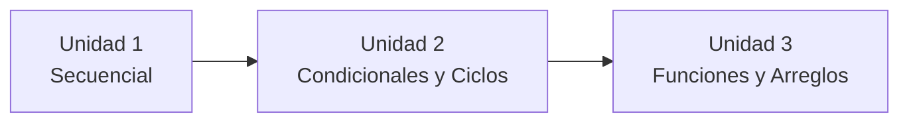

# 🧭 Conclusiones Generales
### Síntesis del Portafolio · Fundamentos de Programación

---

## 📑 Tabla de contenido

- [🔄 1. Un proceso iterativo, no lineal](#-1-un-proceso-iterativo-no-lineal)
- [🧪 2. La prueba de escritorio como control de calidad](#-2-la-prueba-de-escritorio-como-control-de-calidad)
- [📈 3. Progresión de complejidad entre unidades](#-3-progresión-de-complejidad-entre-unidades)
- [⚠️ 4. Un patrón común en las dificultades](#️-4-un-patrón-común-en-las-dificultades)
- [🎯 5. El problema define la estructura, no la costumbre](#-5-el-problema-define-la-estructura-no-la-costumbre)
- [🏁 6. Cierre](#-6-cierre)

---

## 🔄 1. Un proceso iterativo, no lineal

> A lo largo de las tres unidades se repite una misma lección: el diseño de algoritmos rara vez sale bien a la primera.

Tanto en el ejercicio de envío de equipos **(Unidad 1)**, como en el sistema de triage de donación de sangre **(Unidad 2)** y en el manejo de arreglos **(Unidad 3)**, la solución final surgió de **reescribir, simplificar y depurar** la lógica varias veces — no de una única pasada de análisis → diseño → codificación.

---

## 🧪 2. La prueba de escritorio como control de calidad

Se menciona explícitamente como pilar en las **tres unidades**. Es especialmente crítica porque los errores más peligrosos no son detectados por el compilador:

| Tipo de error | Unidad | ¿Detectado por el compilador? |
|---|:---:|:---:|
| Bucles infinitos | 2 | ❌ No |
| Condiciones mal definidas | 2 | ❌ No |
| Índices fuera de rango en arreglos | 3 | ❌ No |

> ⚠️ Son errores de **lógica**, no de **sintaxis** — solo se manifiestan en tiempo de ejecución.

---

## 📈 3. Progresión de complejidad entre unidades

| Unidad | Enfoque | Pregunta clave que resuelve |
|:---:|---|---|
| 1️⃣ | Algoritmo, pseudocódigo, diagrama de flujo | ¿Qué pasos sigo, en qué orden? |
| 2️⃣ | Condicionales y ciclos | ¿Cuándo y cuántas veces se ejecuta un bloque? |
| 3️⃣ | Funciones y arreglos (1D, 2D, multidimensionales) | ¿Cómo organizo el código y los datos? |

Cada unidad **construye sobre la anterior**:

- El sistema de triage (U2) reutiliza la lógica de **acumuladores y contadores** vista en U1.
- Los arreglos multidimensionales (U3) son una extensión directa de los **ciclos anidados** practicados en U2.

---

## ⚠️ 4. Un patrón común en las dificultades

Las dificultades reportadas comparten un mismo origen: **distinguir mecanismos que "se parecen" pero son estructuralmente distintos**.

<table>
<tr>
<td width="33%" valign="top">

**🔁 `While` vs. `Do-While`**

¿La condición se evalúa antes o después de ejecutar el bloque?

</td>
<td width="33%" valign="top">

**📤 Valor vs. Referencia**

¿Se copia el dato o se copia su dirección de memoria?

</td>
<td width="33%" valign="top">

**🧱 1D vs. Multidimensional**

¿Cuántos índices y ciclos anidados hacen falta?

</td>
</tr>
</table>

> 💡 En todos los casos, la confusión inicial se resolvió no memorizando la sintaxis, sino **entendiendo el mecanismo interno**: qué ocurre en memoria y cuándo se evalúa la condición.

---

## 🎯 5. El problema define la estructura, no la costumbre

La elección de estructuras debe basarse en un **análisis riguroso del problema**, no en la preferencia o costumbre del programador. Esta idea aparece de forma explícita como reflexión crítica en las Unidades 2 y 3.

| Decisión mal fundamentada | Consecuencia |
|---|---|
| Usar `if-else` anidado en vez de `switch` | Código menos legible de lo necesario |
| Forzar datos complejos en un arreglo 1D | Estructura difícil de mantener |
| Añadir dimensiones sin necesidad real | Complejidad innecesaria |

---

## 🏁 6. Cierre

**El portafolio traza un recorrido claro:**

`Resolver un problema` → `Diseñar la lógica` → `Controlar el flujo` → `Organizar código y datos`

En conjunto, el documento avanza desde **algoritmos secuenciales simples**, pasando por **lógica de decisión y repetición**, hasta llegar a **organizar el código en módulos reutilizables** y **estructurar datos complejos** de forma eficiente — con la **prueba de escritorio** como hilo conductor de validación en cada etapa.

---

[🏠 Regresar al inicio](index.md)

