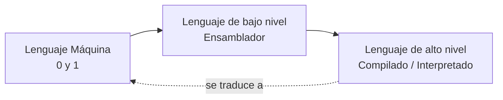

<div align="center">

# 📘 Unidad 1
### Fundamentos de la Resolución de Problemas y Programación


</div>

---

## 📑 Tabla de contenido

- [🧩 Resolución de Problemas](#-resolución-de-problemas)
- [1. Conceptos fundamentales](#1-conceptos-fundamentales)
  - [a. Algoritmo](#a-algoritmo)
  - [b. Pseudocódigo](#b-pseudocódigo)
  - [c. Diagrama de Flujo](#c-diagrama-de-flujo)
  - [d. Prueba de Escritorio](#d-prueba-de-escritorio)
  - [e. Lenguajes de programación](#e-lenguajes-de-programación)
  - [f. Programación por bloques](#f-programación-por-bloques)
- [2. Ejercicio con estructura secuencial](#2-ejercicio-con-estructura-secuencial)
- [3. Principales dificultades](#3-principales-dificultades)
- [4. Reflexión crítica](#4-reflexión-crítica)

---

## 🧩 Resolución de Problemas

Resolver un problema real mediante la informática requiere seguir un proceso ordenado de cinco etapas:

| Paso | Etapa | Descripción |
|:---:|---|---|
| 1️⃣ | **Análisis** | Identificar entradas, salidas y restricciones del problema. |
| 2️⃣ | **Diseño** | Elaborar el pseudocódigo o el diagrama de flujo. |
| 3️⃣ | **Codificación** | Traducir el diseño a un lenguaje de programación. |
| 4️⃣ | **Pruebas** | Ejecutar y depurar el programa para eliminar errores. |
| 5️⃣ | **Documentación / Mantenimiento** | Registrar el funcionamiento y prever mejoras futuras. |

---

## 1. Conceptos fundamentales

### a. Algoritmo

> Secuencia de pasos lógicamente ordenados que dan solución a un problema.

Un buen algoritmo se caracteriza por ser:

- ✅ **Preciso** — orden claro, sin ambigüedades.
- ✅ **Definido** — produce el mismo resultado ante las mismas entradas.
- ✅ **Finito** — siempre llega a un fin.

---

### b. Pseudocódigo

Es una herramienta que representa las instrucciones del algoritmo, funcionando como un punto intermedio entre el **lenguaje natural** y el **lenguaje de programación**. Permite centrarse en la lógica antes de enfrentar la sintaxis.

<details>
<summary>💡 <b>Ejemplo: Algoritmo de Ahorro Anual</b> (clic para expandir)</summary>

```pascal
Algoritmo AhorroAnual
    // Definición de variables
    Definir sueldoMensual, ahorroSemanal, ahorroMensual, ahorroAnual Como Real;

    // Entrada de datos
    Escribir "Ingrese el sueldo mensual del trabajador:";
    Leer sueldoMensual;

    // Proceso lógico
    ahorroSemanal = sueldoMensual * 0.15;
    ahorroMensual = ahorroSemanal * 4;   // Considerando 4 semanas por mes
    ahorroAnual   = ahorroMensual * 12;

    // Salida de resultados
    Escribir "El ahorro mensual es: $", ahorroMensual;
    Escribir "El ahorro anual proyectado es: $", ahorroAnual;
FinAlgoritmo
```

</details>

---

### c. Diagrama de Flujo

Es una representación gráfica que emplea simbología estandarizada para visualizar la lógica de un algoritmo.

| Símbolo | Nombre | Uso |
|:---:|---|---|
| ⬭ | **Terminal** | Marca el inicio o el fin del algoritmo. |
| ▭ | **Proceso** | Representa una operación o cálculo. |
| ▱ | **Entrada / Salida** | Paralelogramo para leer o mostrar datos. |
| ➡️ | **Flujo** | Flechas que indican el orden de ejecución. |

<div align="center">

</div>

---

### d. Prueba de Escritorio

Técnica que consiste en ingresar datos de entrada (propios o aleatorios) para verificar el cambio de las variables **paso a paso**, antes de la codificación definitiva.

| Datos de Entrada | Proceso | Datos de Salida |
|:---:|---|:---:|
| Sueldo Mensual | Ahorro mensual · Ahorro total | Ahorro mensual · Ahorro total |
| **$482** | `18.075 × 4 = 72.30` → `72.30 × 12 = 867.60` | Mensual: **$72.30** · Anual: **$867.60** |
| **$1200** | `1200 × 0.15 = 180` → `180 × 12 = 2160` | Mensual: **$180.00** · Anual: **$2160.00** |

---

### e. Lenguajes de programación



| Nivel | Características | Ejemplos |
|---|---|---|
| 🔵 **Máquina** | Código binario (0 y 1); único lenguaje que el procesador ejecuta directamente. Es la base de todo software. | — |
| 🟡 **Bajo nivel (Ensamblador)** | Usa mnemónicos como `ADD`, `DIV`, `STR`. Exige gestionar manualmente memoria y hardware. | ASM |
| 🟢 **Alto nivel** | Cercano al lenguaje humano. Se traduce internamente a lenguaje máquina. | Compilados: C, C++, Java · Interpretados: Python |

---

### f. Programación por bloques

La programación visual crea software mediante **piezas gráficas** que ejecutan comandos y funciones específicas. Se usa para introducir a principiantes y niños en la lógica de programación, eliminando la barrera de la sintaxis y permitiendo enfocarse en la arquitectura del algoritmo y el flujo de control.

<div align="center">

</div>

---

## 2. Ejercicio con estructura secuencial

### 📋 Planteamiento del problema

> Un lote de **10 equipos** debe enviarse a diferentes sectores:
> - 📦 4 equipos → **Mensajería Express**
> - 🚚 2 equipos → **Transporte de Carga**
> - ✉️ 4 equipos → **Correo Convencional** (30% más económico que la Mensajería Express)
>
> El programa debe solicitar el costo unitario de la Mensajería Express y del Transporte de Carga, y calcular el costo total del envío de los 10 equipos.

### 🔍 Análisis del problema

Es necesario calcular el costo total de envío de un lote de 10 equipos distribuidos en tres modalidades de transporte, considerando que una de ellas tiene un costo con descuento respecto a otra.

| Categoría | Elemento | Tipo |
|---|---|:---:|
| **Constantes** | Cantidad de equipos por modalidad | `Entero` |
| **Variables** | Costos, subtotales y total | `Real` |

**Entradas**
- Costo unitario por Mensajería Express
- Costo unitario por Transporte de Carga

**Proceso**
```
Subtotal = costo unitario × cantidad de equipos
Total    = Subtotal1 + Subtotal2 + Subtotal3
```

**Salidas**
- Subtotal Mensajería Express
- Subtotal Transporte de Carga
- Subtotal Correo Convencional
- Costo Total General

### 🎨 Diseño del algoritmo

<details open>
<summary><b>🖼️ Diagrama de flujo</b></summary>

<div align="center">

</div>

</details>

<details>
<summary><b>📝 Pseudocódigo</b> (clic para expandir)</summary>

```pascal
Algoritmo presupuestoEnvio
    // Definición de variables
    Definir costoEquipoM, costoEquipoT Como Real;
    Definir subtotalMensajeriaExpress, subtotalTransporteDeCarga,
            subtotalCorreoConvencional, total Como Real;

    // Datos de entrada
    Escribir "¿Cuál es el costo unitario del equipo enviado por Mensajería Express?";
    Leer costoEquipoM;
    Escribir "¿Cuál es el costo unitario del equipo enviado por Transporte de Carga?";
    Leer costoEquipoT;

    // Proceso
    subtotalMensajeriaExpress = costoEquipoM * 4;
    subtotalTransporteDeCarga = costoEquipoT * 2;
    subtotalCorreoConvencional = (costoEquipoM * 0.7) * 4;
    total = subtotalCorreoConvencional + subtotalMensajeriaExpress + subtotalTransporteDeCarga;

    // Datos de salida
    Escribir "El costo de los equipos enviados por Mensajería Express será: $", subtotalMensajeriaExpress;
    Escribir "El costo de los equipos enviados por Transporte de Carga será: $", subtotalTransporteDeCarga;
    Escribir "El costo de los equipos enviados por Correo Convencional será: $", subtotalCorreoConvencional;
    Escribir "El costo total de los equipos enviados será: $", total;
FinAlgoritmo
```

</details>

### 💻 Codificación (C)

```c
#include <stdio.h>

int main() {

    // Declaración de variables
    float costoEquipoM, costoEquipoT;
    float subtotalMensajeriaExpress, subtotalTransporteDeCarga;
    float subtotalCorreoConvencional, total;

    // Datos de entrada
    printf("¿Cuál es el costo unitario del equipo enviado por Mensajería Express?\n");
    scanf("%f", &costoEquipoM);
    printf("¿Cuál es el costo unitario del equipo enviado por Transporte de Carga?\n");
    scanf("%f", &costoEquipoT);

    // Proceso
    subtotalMensajeriaExpress = costoEquipoM * 4;
    subtotalTransporteDeCarga = costoEquipoT * 2;
    subtotalCorreoConvencional = (costoEquipoM * 0.7) * 4;
    total = subtotalCorreoConvencional + subtotalMensajeriaExpress + subtotalTransporteDeCarga;

    // Datos de salida
    printf("El costo de los equipos enviados por Mensajería Express será: $%.2f\n", subtotalMensajeriaExpress);
    printf("El costo de los equipos enviados por Transporte de Carga será: $%.2f\n", subtotalTransporteDeCarga);
    printf("El costo de los equipos enviados por Correo Convencional será: $%.2f\n", subtotalCorreoConvencional);
    printf("El costo total de los equipos enviados será: $%.2f\n", total);

    return 0;
}
```

### ✅ Validación

**Fórmulas utilizadas**

```
subtotalExpress      = costoEquipoM * 4
subtotalCarga         = costoEquipoT * 2
subtotalConvencional  = (costoEquipoM * 0.7) * 4
total                 = subtotalExpress + subtotalCarga + subtotalConvencional
```

| Caso | Costo Express | Costo Carga | Subtotal Express | Subtotal Carga | Subtotal Convencional | **Total** |
|:---:|:---:|:---:|:---:|:---:|:---:|:---:|
| **Entrada 1** | $24.00 | $52.00 | $96.00 | $104.00 | $67.20 | **$267.20** |
| **Entrada 2** | $12.80 | $9.50 | $51.20 | $19.00 | $35.84 | **$106.04** |

<details>
<summary>🖥️ <b>Comprobación en consola — Entrada 1</b></summary>

<div align="center">

</div>

</details>

<details>
<summary>🖥️ <b>Comprobación en consola — Entrada 2</b></summary>

<div align="center">

</div>

</details>

---

## 3. Principales dificultades

> Una de las mayores dificultades que enfrenté al inicio fue comprender que el diseño de algoritmos no es un proceso lineal. Requiere reescribir el código tras un análisis más profundo, lo que permite simplificar la lógica y entender mejor el ejercicio. Gracias a las prácticas, tanto personales como en clase, logré reconocer patrones en los problemas, encontrando soluciones más sencillas para desafíos que inicialmente parecían complejos.

## 4. Reflexión crítica

> La buena costumbre de realizar pruebas de escritorio es el pilar de la formación, porque permite detectar fallos antes de la implementación final. Entender que un programa es la ejecución de una serie de pasos nos asegura que cada instrucción cumpla su respectivo propósito.

---

<div align="center">

[⬅️ Regresar al inicio](index.md)

</div>
